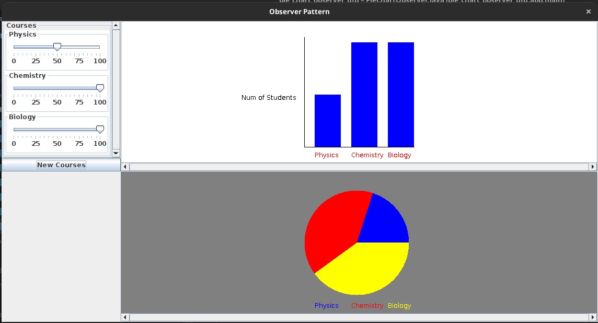
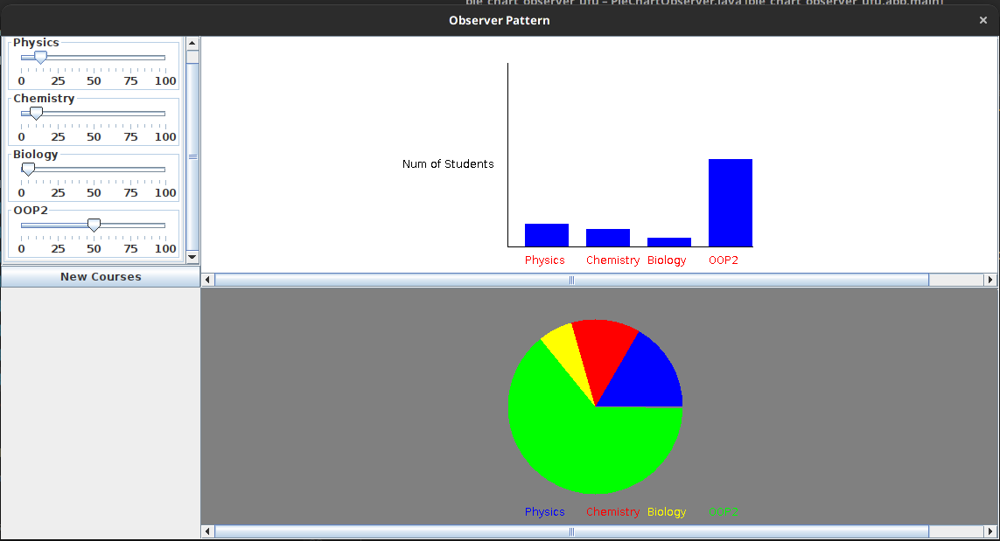

# pie chart observer

Atividade: Modifique o programa com padrão para incluir o gráfico de Pizza. A tela deverá ficar parecida com esta
abaixo. Dica: veja o arquivo how_to_draw_a_pie_chart.txt na versão sem padrão. Não precise preocupar com muitos detalhes
de layout. Não é este o objetivo desta prática, mas sim a aplicação do padrão Observer.

Explore a flexibilidade do Observer.

- A classe para PieChart precisa ser estendida para saber onde está SubjectData
- registrar no SliderSubject
- (3) manipular os updates de SliderSubject. Veja a classe BarChartObserver para ter uma ideia inicial.

## Dando orgulho aos nossos mestres

Existe uma mistura dos detalhes da implementação com a interface
__Subject__ do design pattern observer.

```java
    ...
//Observable.java
public abstract Object getUpdate();

protected Vector<Observer> observers;
```

Um vetor de observadores é um detalhe de implementação,
então para agradar os deuses dos softwares reusáveis, separamos os
detalhes da implementação de sua interface.

Percebemos também que

```java
public interface Observer {
    /**
     * Informs this observer that an observed subject has changed
     *
     * @param o
     *            the observed subject that has changed
     */
    void update(Observable o);
}
```

Observer também __depende de Observable__ que por sua fez possui detalhes de implementação. Então a partir de agora __
Observer__
é genérico.

```java
public interface Subject<Event> {
    void attach(Observer<Event> e);

    void detach(Observer<Event> e);

    void notifyObservers();
}
```

```java
public interface Observer<Event> {
    /**
     * Informs this observer that an observed subject has changed
     *
     * @param e the observed event that has changed
     */
    void update(Event e);
}
```

Dessa forma, o design pattern não conhece a sua implementação, mas sabe um evento será trafegado entre Observer e
Subject.

Analisando o [CourseRecord](app/src/main/java/pie_chart_observer_ufu/CourseRecord.java)
percemos que é um __struct__ ou __DataClass__ disfarçado de objeto, onde os seus métodos, getters e setters podem ser
eliminados.

```java
public class CourseRecord {

    private String name;
    private int numOfStudents;

    public CourseRecord(String courseName, int numOfStudents) {
        this.name = courseName;
        this.numOfStudents = numOfStudents;
    }

    public int getNumOfStudents() {
        return numOfStudents;
    }

    public String getName() {
        return name;
    }

    public void setNumOfStudents(int numOfStudents) {
        this.numOfStudents = numOfStudents;
    }

    public String toString() {
        return "Course = " + this.name + ", Number of Students = "
                + this.numOfStudents;
    }
}
```

Geralmente eu não faço essa alteração, mas com uma boa IDE e o projeto sendo pequeno é bem tranquilo a alteração.

A única ponta solta que sobrou foi o __Observable__ cujo péssimo nome não informa que tipo de __Sujeito__ ele é. Bom
pelos detalhes de implementação que tal __CourseRecordSubject__ ?

```java
public class CourseRecordSubject implements Subject<Vector<CourseRecord>> {
    ...
```

Parece que eu nem preciso ler o resto da classe para entender o ela faz, uma vez sabendo o design pattern Observer. É um
bom nome.

Observamos o CourseRecordSubject que é um __ConcreteSubject__
logo, não é interessante extender classes concretas, melhor decompor. As dependências ficaram assim:

```java
//CourseData.java
public CourseData(Subject<Vector<CourseRecord>>subject){
        this.courseData=new Vector<>();
        this.courseRecordSubject=subject;
        }

// BarChartObserver.java
public BarChartObserver(Vector<CourseRecord> initialData){
        this.courseData=initialData;
```

Toda a parte relacionada ao Observer ficou relativamente desacoplada e a comunicação entre o BarChat e CourseData se dá
dinamicamente:

```java
//app.java
public static void main(String[]args){

        CourseRecordSubject subject=new CourseRecordSubject();

        ...

        CourseController controller=new CourseController(data);
        subject.attach(controller);

        BarChartObserver bar=new BarChartObserver(data.getUpdate());
        subject.attach(bar);

        ....

```

baixo acoplamento e a "liberdade de acrescentar e remover observadores a qualquer momento" são os pontos mais fortes
desse Pattern.

## Tudo acaba em Pizza

a partir do código [How to draw a pie chart.txt](How_to_draw_a_%20pie_chart.txt)

```java

/*
        Here is a code segment that draws a pie chart given a Graphics object and
        an Array containing Integers to be represented in the pie chart. It is drawn
        at location (xOffset, yOffset) and with the radius specified to be of size 100.

 */
public void paint(Graphics g, Integer[] data) {
        super.paint(g);
        int radius = 100;

        //first compute the total number of students
        double total = 0.0;
        for (int i = 0; i < data.length; i++) {
        total += data[i];
        }
        //if total == 0 nothing to draw
        if (total != 0) {
        double startAngle = 0.0;
        for (int i = 0; i < data.length; i++) {
            double ratio = (data[i] / total) * 360.0;
            //draw the arc
            g.setColor(LayoutConstants.subjectColors[i%LayoutConstants.subjectColors.length]);
            g.fillArc(LayoutConstants.xOffset, LayoutConstants.yOffset + 300, 2 * radius, 2 * radius, (int) startAngle, (int) ratio);
            startAngle += ratio;
            }
        }
}
```
foi feito uma série de CTRL+C e CTRL+V a qual ocasionou o
seguinte código:

```java
 public PieChartObserver(Vector<CourseRecord> records) {
        this.records = records;
        ....
    }
```

```java
// app.java
  BarChartObserver bar = new BarChartObserver(data.getUpdate());
  subject.attach(bar);
  JScrollPane barScrollPane = new JScrollPane(bar,
                JScrollPane.VERTICAL_SCROLLBAR_AS_NEEDED,
                JScrollPane.HORIZONTAL_SCROLLBAR_ALWAYS);
        
  PieChartObserver pieChart = new PieChartObserver(data.getUpdate());
  subject.attach(pieChart);
  JScrollPane pieScrollPane = new JScrollPane(pieChart,
            JScrollPane.VERTICAL_SCROLLBAR_AS_NEEDED,
            JScrollPane.HORIZONTAL_SCROLLBAR_ALWAYS);
        ....
          constraints.weightx = 0.5;
          constraints.weighty = 1.0;
          constraints.gridx = 1;
          constraints.gridy = 0;
          frame.getContentPane().add(barScrollPane, constraints);
          constraints.weightx = 0.5;
          constraints.weighty = 1.0;
          constraints.gridx = 1;
          constraints.gridy = 1;
          frame.getContentPane().add(pieScrollPane, constraints);
          ....
```
Os deuses dos softwares reusáveis estão zangados novamente,
no entanto, agora tenho as nossas telinhas prontinhas :D



